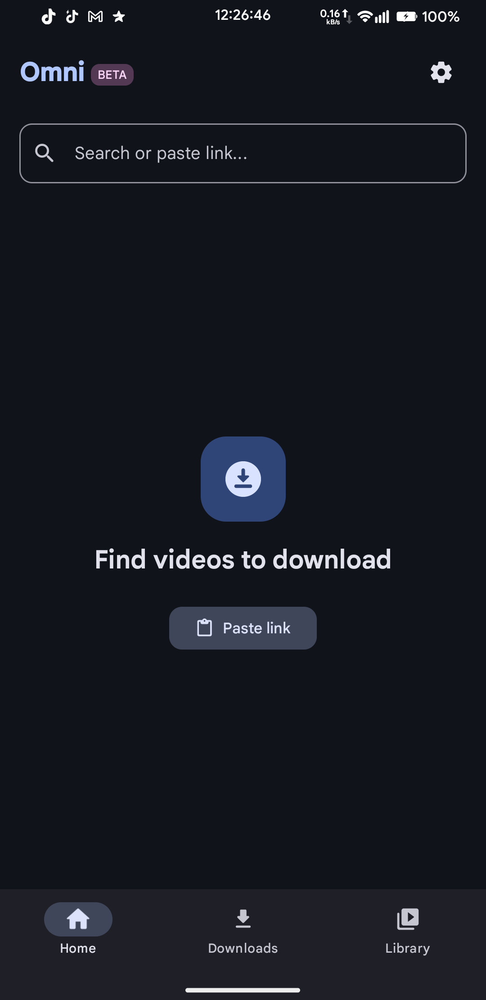
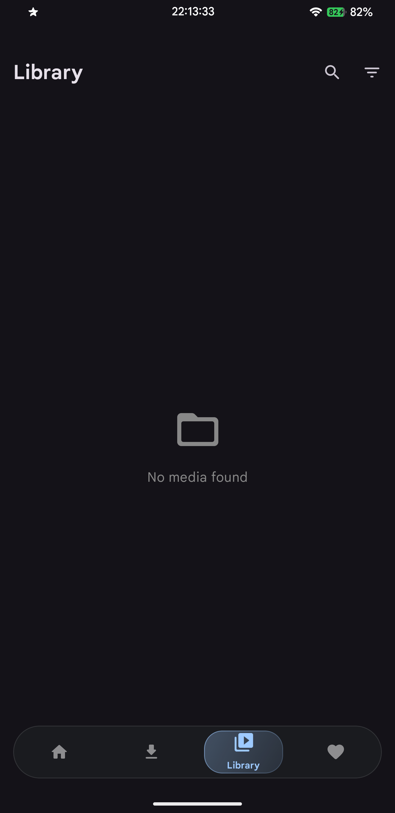
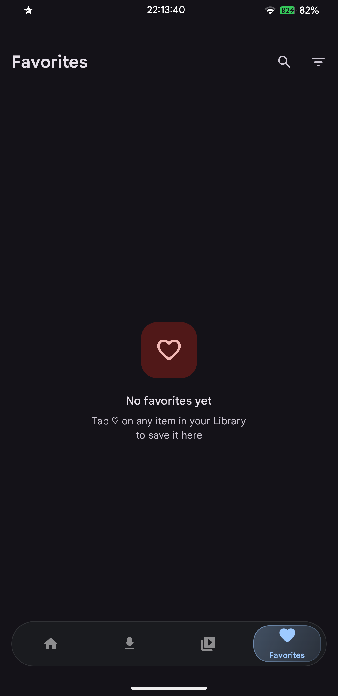
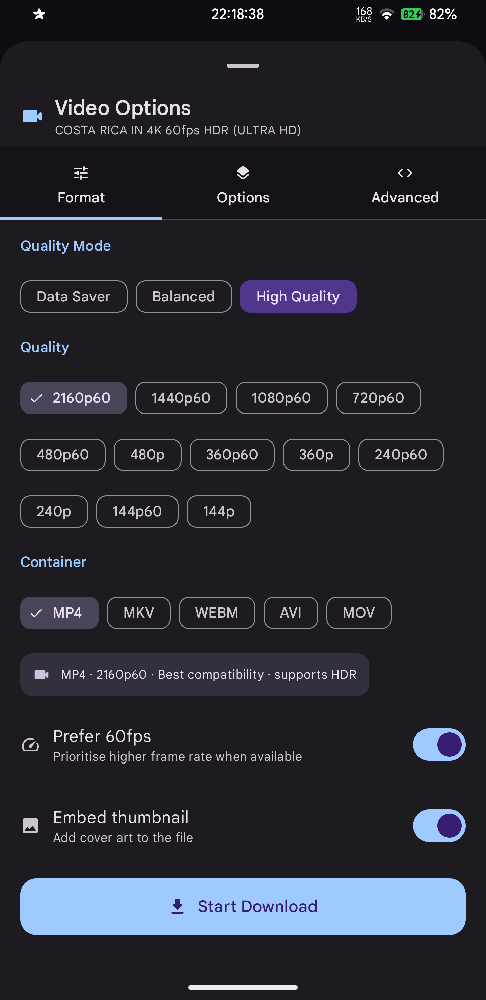
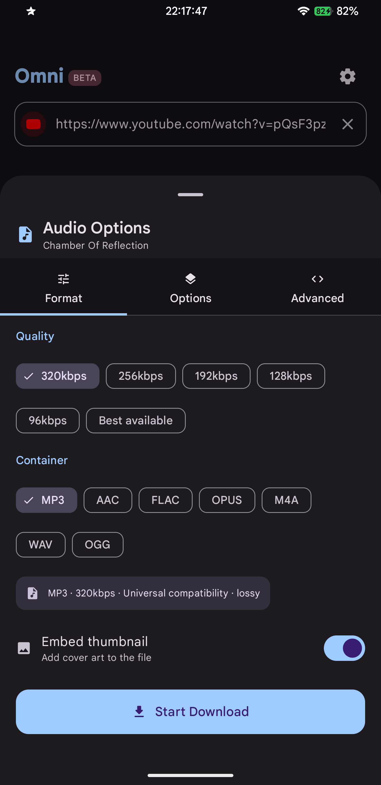
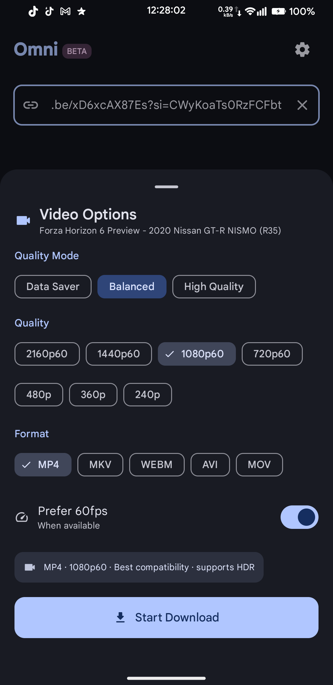
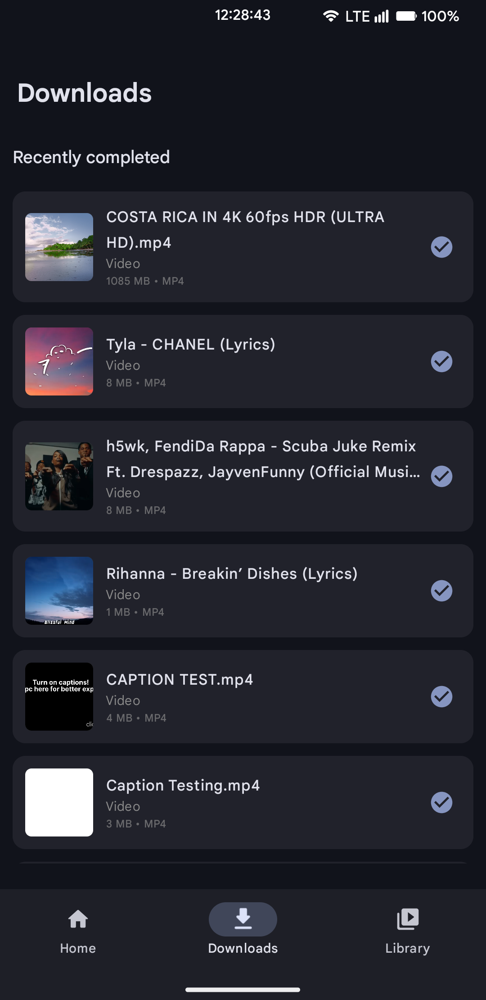
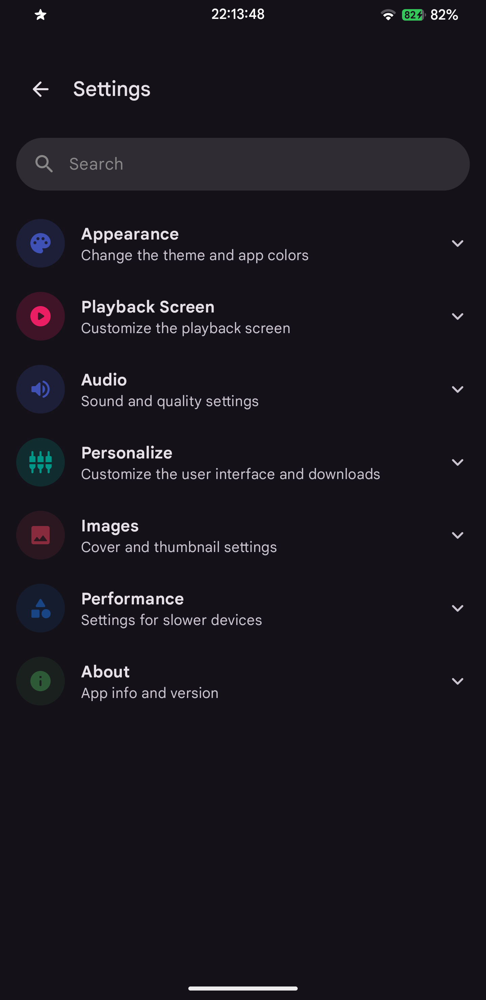

<div align="center">

<br/>


**The last video downloader you'll ever need.**

[](https://developer.android.com)
[](https://kotlinlang.org)
[](https://developer.android.com/compose)
[](LICENSE)
[](https://github.com/yt-dlp/yt-dlp)
[](https://github.com/ferrdishx/omni/releases)

<br/>

</div>

---

## Screenshots

<div align="center">

| Home | Library | Favorites | Video Options | Audio Options | Download Options | Downloads | Settings |
| :---: | :---: | :---: | :---: | :---: | :---: | :---: | :---: |
|  |  |  |  |  |  |  |  |


</div>

## What is Omni?

Omni is a free, open-source Android app that downloads video and audio from pretty much anywhere and plays it back with a proper built-in player. No ads, no account, no nonsense.

It uses **yt-dlp** and **FFmpeg** under the hood, so it supports [700+ sites](https://github.com/yt-dlp/yt-dlp/blob/master/supportedsites.md) out of the box. Downloads go up to 4K 60fps for video and 320kbps for audio. The engine updates itself automatically so things don't randomly break when YouTube changes something.

## Features

### Downloading

YouTube, Instagram, TikTok, Twitter/X, SoundCloud and hundreds more are supported. Video and audio streams are merged automatically via FFmpeg, so you actually get the highest quality instead of whatever the fallback is. The format picker only shows qualities that actually exist for each video with no fake options.

Audio downloads can embed the thumbnail directly into the file, so your MP3s show up with cover art in any player.

### Playback

The built-in player uses ExoPlayer (Media3) and handles everything : background audio, lock screen controls, Picture-in-Picture, and a MiniPlayer that stays visible while you browse the app. On Android 12+, PiP kicks in automatically when you leave the app while a video is playing.

### Interface

The UI adapts its colors to your wallpaper via Material You. Fully edge-to-edge, dark and light themes, and an option to reduce animations if you prefer a calmer experience.

## Tech Stack

```
Language        Kotlin
UI              Jetpack Compose + Material Design 3
Architecture    MVVM (ViewModel + StateFlow)
Download Engine youtubedl-android (yt-dlp) + FFmpeg
Player          Media3 (ExoPlayer) + MediaSession
Database        Room
Preferences     DataStore
Images          Coil
```

## Download

> Omni is distributed as a high-performance app with full FFmpeg support. Due to its advanced features, the APK size exceeds 30MB and is hosted exclusively on GitHub for maximum quality.

<div align="center">

[](https://github.com/ferrdishx/omni/releases/latest)

</div>

### 🚀 Automatic Updates (Recommended)
To keep Omni updated automatically without the Play Store, we recommend using **[Obtainium](https://github.com/ImranRk/Obtainium)**. 

Simply copy the repository URL below and paste it directly into Obtainium:
`https://github.com/ferrdishx/Omni`

**Requirements:** Android 8.0+ · ARM64 (recommended) / ARMv7 / x86_64

## How to Use

Copy a link from any app, open Omni and paste it (or share directly to Omni). Pick your format and quality, only the options that actually exist for that video are shown. Hit **Start Download** and watch the progress in the Downloads tab. Files land in `Downloads/Omni` on your device.

On first launch Omni downloads the yt-dlp engine (~15MB). This happens once.

## Build from Source

```bash
git clone https://github.com/ferrdishx/omni.git
cd omni
```

Open in Android Studio Hedgehog or newer, sync Gradle and run. You'll need JDK 17 and Android SDK 35.

## Supported Platforms

<div align="center">

| Platform | Video | Audio |
|----------|-------|-------|
| YouTube | ✅ Up to 4K 60fps | ✅ Up to 320kbps |
| Instagram | ✅ Reels, Stories, Posts | ✅ |
| TikTok | ✅ | ✅ |
| Twitter / X | ✅ | ✅ |
| SoundCloud | — | ✅ |
| Vimeo | ✅ | ✅ |
| Reddit | ✅ | ✅ |
| + 700 more | [See full list →](https://github.com/yt-dlp/yt-dlp/blob/master/supportedsites.md) | |

</div>

## Permissions

| Permission | Why |
|-----------|-----|
| `INTERNET` | Fetch video info and download content |
| `READ_MEDIA_VIDEO` / `READ_MEDIA_AUDIO` | Access your downloaded files (Android 13+) |
| `WRITE_EXTERNAL_STORAGE` | Save files to storage (Android 9 and below) |
| `POST_NOTIFICATIONS` | Show download progress |
| `FOREGROUND_SERVICE` | Keep downloads running in the background |

## Roadmap

- [x] Universal video/audio download
- [x] Real format & quality detection
- [x] Embedded thumbnail in audio files
- [x] ExoPlayer with background playback
- [x] Picture-in-Picture
- [x] MiniPlayer
- [x] Favorites & Library
- [x] Playlist download 
- [ ] Sleep timer
- [ ] SponsorBlock integration
- [ ] F-Droid release

## Contributing

PRs are welcome. Open an issue first for anything big.

```bash
git checkout -b feat/your-feature
```

## Legal

Omni is a tool. You're responsible for what you download with it. Only download content you have the right to.

This project has no affiliation with YouTube, Google, or any platform it supports.

# Credits

Omni is built on the shoulders of other open source projects. Several UI patterns, architectural ideas, and components were adapted from the work below.

---

## RetroMusicPlayer (now Metro Music)

**What was used:** The Settings screen layout, specifically the accordion category pattern with colored circular icons, expandable sections, and the overall visual hierarchy. The dynamic color palette extraction from artwork (using `androidx.palette`) applied as a blurred background tint in the player screen also follows the same approach used in Retro Music.

**Repository:** [github.com/RetroMusicPlayer/RetroMusicPlayer](https://github.com/RetroMusicPlayer/RetroMusicPlayer)  
**License:** [GPL-3.0](https://github.com/RetroMusicPlayer/RetroMusicPlayer/blob/dev/LICENSE)  
**Author:** h4h13 and contributors

---

## YtDlnis

**What was used:** The download system data layer, the `HistoryItem` entity structure, DAO query patterns with multi-column sorting and filtering, and the overall approach to managing a download queue with status tracking were adapted from YtDlnis.

**Repository:** [github.com/deniscerri/ytdlnis](https://github.com/deniscerri/ytdlnis)  
**License:** [GPL-3.0](https://github.com/deniscerri/ytdlnis/blob/main/LICENSE)  
**Author:** deniscerri

---

## Libraries

| Library | What it does | License |
|---------|-------------|---------|
| [youtubedl-android](https://github.com/yausername/youtubedl-android) | yt-dlp wrapper for Android | GPL-3.0 |
| [ffmpeg-kit](https://github.com/arthenica/ffmpeg-kit) | FFmpeg for Android | LGPL-3.0 |
| [Media3 (ExoPlayer)](https://github.com/androidx/media) | Video and audio playback | Apache-2.0 |
| [Coil](https://github.com/coil-kt/coil) | Image loading | Apache-2.0 |
| [Room](https://developer.android.com/training/data-storage/room) | Local database | Apache-2.0 |
| [DataStore](https://developer.android.com/topic/libraries/architecture/datastore) | Preferences storage | Apache-2.0 |
| [Palette](https://developer.android.com/develop/ui/views/graphics/palette-colors) | Dynamic color extraction from artwork | Apache-2.0 |

## License

GPL-3.0 · Built by [ferrdishx](https://github.com/ferrdishx)

<div align="center">
